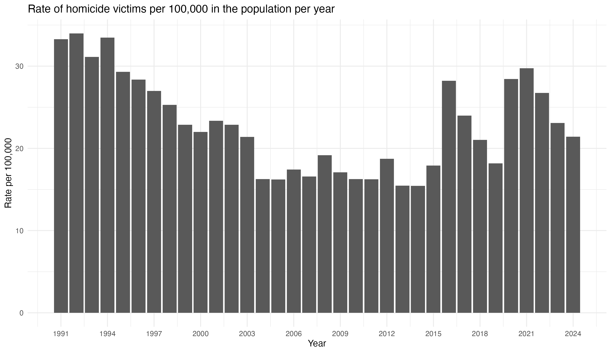
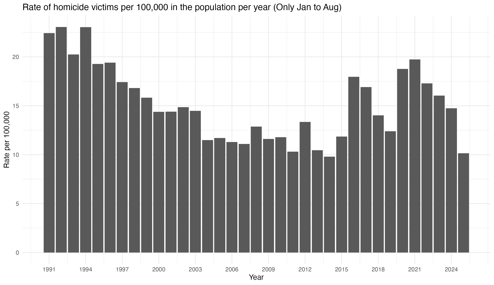
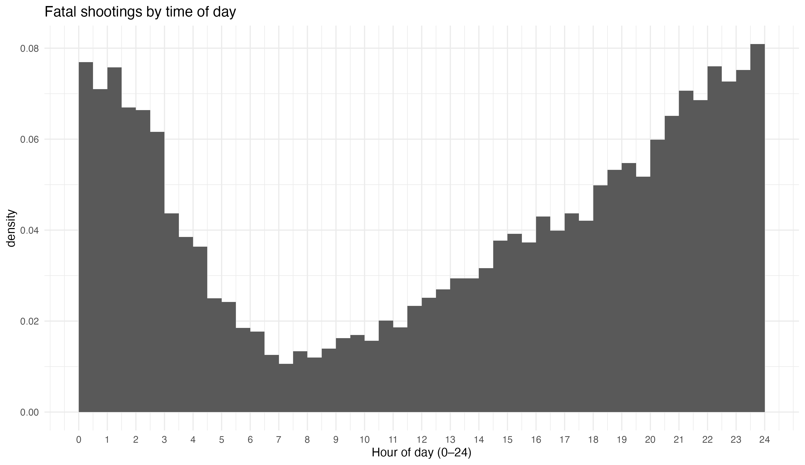
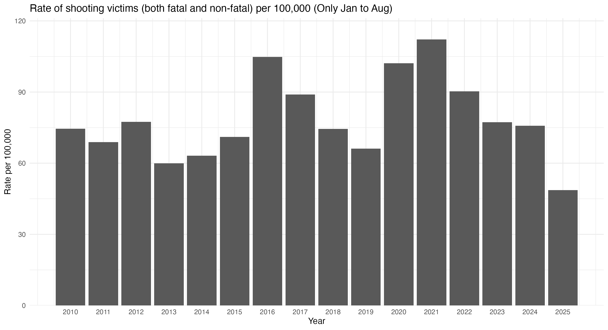

# Statistical exercises

## 1. Suppose a bowl contains 150 objects: 30 red circles, 90 green squares, 15 blue triangles, and 15 red squares.

### 1.1. What’s the probability of drawing a green object? What’s the probability of drawing a red object?

The probability of drawing a green object is 60% and for drawing a red object 30%. For instance:

  $$P(green) = \frac{90}{150} = 0.60 = 60\%$$

  $$P(red) = \frac{45}{150} = 0.30 = 30\%$$

### 1.2. Suppose you are blindfolded and you draw an object from the bowl. You feel that it is square. What is the probability it is red? What is the probability it is blue?

The probability of drawing a red square is 14% and for drawing a blue square is 0% because the sample does not contain blue squares. For instance:

  $$P(red|square) = \frac{15}{105} = 0.14= 14\%$$

  $$P(blue|square) = \frac{0}{105} = 0 = 0\%$$

### 1.3. Your friend hears you say that it is a square object, but she can’t see the color of the object, which is concealed in your hand. She offers a bet. Specifically, if the object in your hand is green, your friend wins and you have to pay her $5. However, if the object in your hand is red, you win and your friend has to pay you $50. What is your expected financial return from the game? What is your friend’s expected financial return?

My expected financial return is $7 and my friend's expected financial return is $4.28. For instance:

  $$E(friends\ return) = P(green|square) = \frac{90}{105} = 0.857 * 5 = 4.28$$

  $$E(my\ return) = P(red|square) = \frac{15}{105} = 0.14 * 50 = 7$$


### 1.4. What’s the probability of drawing a red object conditional on having drawn a red circle with replacement? What’s that probability without replacement?

With replacement, the probability of drawing a red object conditional on having drawn a red circle is 30%. Without replacement, the probability is 29.53%.

With replacement: 
  $$P(red|red\ circle) = \frac{45}{150}) = 0.30 = 30\%$$

Without replacement: 
  $$P(red|red\ circle) = \frac{44}{149} = 0.2953 = 29.53\%$$


## 2. Suppose a policy school has 50 faculty members: 20 study only politics, 25 study only economics, and 5 study both politics and economics. Further suppose this policy school requires you to sit for an oral exam at the end of the quarter and chooses a faculty member at random to examine you.

### 2.1. What is the probability your examiner studies only economics?
The probability that my examiner studies only economics is 50%. 

  $$P(economics|faculty\ members) = \frac{25}{50} = 0.50 = 50\%$$

## 2.2. What is the probability your examiner studies economics?
The probability that my examiner studies economics is 60%. 

  $$P(economics|faculty\ members) = \frac{30}{50} = 0.60 = 60\%$$
  
### 2.3. What is the probability your examiner is junior and studies only politics?
The probability that my examiner is junior and studies only politics is 10%. 

  $$P(junior\ and\ politics|faculty\ members) = \frac{5}{50} = 0.10 = 10\%$$
  
### 2.4. Are studying politics and studying economics disjoint events? Briefly explain in one sentence.
No, because there are faculty members that study both politics and economics.

### 2.5 Suppose you learn from a reliable source that your grader studies only politics. Is this informative as to their seniority status? Briefly explain and demonstrate why your answer is true by calculating the relevant probabilities.
Yes, because the probability of being a senior given that we already know that studies politicas is 75%, which is significantly higher than the probability of being a junior.

  $$P(senior|politics) = \frac{15}{20} = 0.75 = 75\%$$

  $$P(junior|politics) = \frac{5}{20} = 0.25 = 25\%$$
  
## 3. Suppose the size composition of households in the population of a city is displayed in the table below. Let X indicate the size of a household. Find the expected value of X. [2pt]

$$E[X] = 2$$

The calculation was: 
$$E[X] = \sum_{i=1}^{k} x^i * f(x^i) = (1)(0.50) + (2)(0.25) + (3)(0.05) + (4)(0.15) + (5)(0.05) = 2$$

## 4. Considering the CDF of the exercise
### 4.1. Plot the PMF or PDF that corresponds to the above CDF. [2pt]


### 4.2. What is the expected value of Y? [1pt]

$$E[Y] = 4$$
For instance, based on the information provided in the CDF and PMF, the calculation was:
$$E[Y] = \sum_{i=1}^{k} y^i * f(y^i) = (0)(0) + (1)(0.2) + (2)(0) + (3)(0.3) + (4)(0) + (5)(0.1) + (6)(0.4) = 4$$

## 5. Consider the function below.

### 5.1. Is the above function a valid PDF? Briefly explain how you know.

### 5.2. Find the following quantities

### 5.3. If the function is a valid PDF for Z, plot the CDF for Z.

## 6. Consider the probability density function below.

### 6.1. What is the expected value of X? If it is not possible to determine that value, briefly explain why.
### 6.2. Find P (2 <= X <= 4). If it is not possible to determine that value, briefly explain why.
### 6.3. Find P (5 <= X <= 6). If it is not possible to determine that value, briefly explain why.
### 6.4. Let F (x) indicate the cumulative distribution function for X. Find F (3). If it is not possible to determine that value, briefly explain why.

## 7. Indicate whether each statement below is true or false. If the statement is false briefly explain in 1-2 sentences why it is false. [3pt]

### 7.1. 

True.

### 7.2. 

True.

### 7.3.

True.

### 7.4. 

True.

### 7.5. 

False. Because if the rural residents are over-sampler, their weight should be less than non-rural residents to compensete.

### 7.6. 

True.

\newpage

# Data Exercise

## 8. How many total homicide victims were there in 2024? [1pt]

583 homicides victims.
s
## 9. In what year was the homicide rate the highest? Write a single line of code todetermine this answer. [0.5pt]

`````r
victims_year %>% filter(rate_100k == max(rate_100k))
`````

1992 with a rate of 33.98 homicides per 100,000 of the population for that same year.

## 10. In what year was the homicide rate the lowest? Again, write a single line of code to find this answer. [0.5pt]

`````r
victims_year %>% filter(rate_100k == min(rate_100k))
`````

2014 with a rate of 15.43 homicides per 100,000 of the population.


## 11. Plot the trend over time in homicides per 100,000 in the population from 1991 to 2024. [2pt]



\newpage

## 12. Plot the trend over time in homicides per 100,000 from January to August for the period 1991 to 2025. Briefly compare the homicide rate in 2025 thus far to the rate in recent decades in Chicago in 1-2 sentences. [2pt]

The homicide rate (per 100,000 of the population) in 2025 from January to August is the lowest since 2014. And the second lowest in the entire dataframe, signaling a des-calation of this type of crime since its highest point in 2021.




## 13. How many total victims of shootings (both fatal and non-fatal) were there in 2024? How many victims of fatal shootings were there in 2024? [1pt]

2854 shooting victims in 2024 and 515 fatal shootings the same year.

\newpage

## 14. Plot a histogram that displays the distribution of fatal shootings by time of day (i.e., hour and minute in the day). Around what time of day are fatal shootings least frequent? [2pt]

Fatal shootings are less frequent during the early morning hours, mostly between 6 to 9 am. Nonetheless, the lowest peak of the day is specifically between 7:00 to 7:30 am. (Note: I fixed the bin wwidth to 0.5, meaning for 30-minutes each).




\newpage

## 15. Create a plot in which you graph the over-time trend in shooting victims per 100,000 in the population for the period from 2010-2025 (for January through August). How does 2025 compare to the period prior to the pandemic (i.e., pre-2020) for shooting victims based on your plot? [2pt]




Results of 2025 for the given months (January to August) are lower that all of the years available in the dataframe. While in 2025, based on the avaible data, the rate in shooting victims per 100,000 in the population is 48.61. In addition between 2010 and 2019 for the same months (pre-pandemic era), the lowest rate was in 2013 with a result of 59.93.


